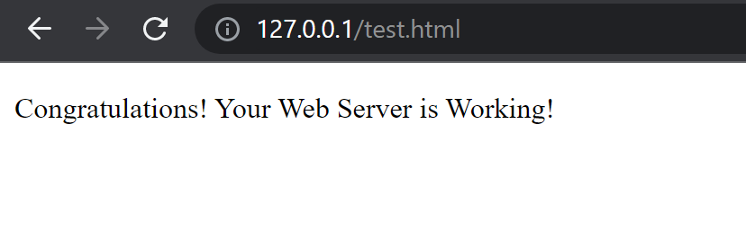

# Socket_WebServer

## Testing Web Server
Test the webserver by opening a new tab in a web browser.
Input into the address bar `http://127.0.0.1:80/{filename}.html`

Currently, the Server Host is local host with port 80.
The list of `filename` that can be loaded onto the webserver are:
- test.html

You should see the content of the filename on the web page after entering the address.

